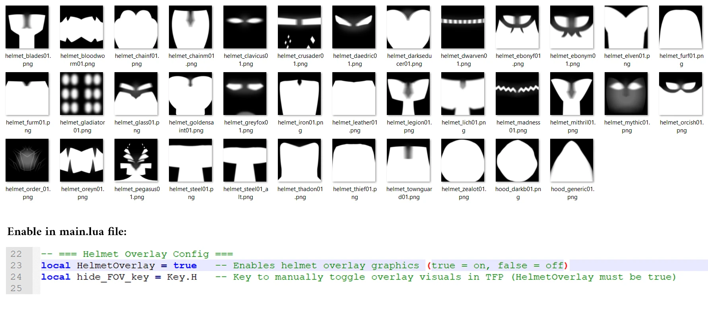

# True First Person Camera – for Oblivion Remastered

## What This Mod Does
This mod adds a configurable, immersive first-person camera system by utilizing the existing third-person camera via UE4SS.  
Play the game in true first person just like in immersive sim titles or ARMA.

**Highly Customizable:** Adjust the camera position, freelook behavior, FOV, helmet overlays, and movement to perfectly match your character’s body, race, proportions, and gear. Every character is different. This mod is designed to reflect that.

## Main Features
✔ **Head-Aligned First Person** — Camera sits between your character’s eyes for perfect perspective.  
✔ **Full Body Awareness** — Look down and see your own body, arms, legs, and gear.  
✔ **Immersive Visor Overlays** — Unique visor masks for all vanilla helmets/hoods, dynamically swapped on equip.  
✔ **Freelook Mode** — Hold or toggle to look around independently of body facing, with optional parallax (default V).  
✔ **Custom FOV** — Override the default FOV with your Custom FOV while in TFP mode.  
✔ **Speed Control (optional)** — Use the mouse wheel to change your walking/running speed on the fly.  
✔ **Easy Toggle** — Quickly enable/disable on demand using a hotkey.  
✔ **State Persistence** — Remembers your TFP and freelook states between sessions with external `.txt` file. - No savegame files are touched.  
✔ **No Intrusive Changes** — Does not edit meshes, animations, or core game files. - You can install/uninstall at any time.  
✔ **Fully Configurable** — Adjust camera offsets, freelook behavior, toggle keys, and more.  

### ⚠️ Toggle Key Info – "OEM_Plus" (Configurable)

The default toggle key is set to: **OEM_Plus**  
This can be different depending on your keyboard layout:

- **QWERTY**: usually `=` or `+` (not the numpad +, but the key with =/+)
- **QWERTZ**: may appear as `*` (left of the Return key)
- **AZERTY**: it’s `=`

**If the toggle key doesn’t work or feels awkward, you can change it!**  

Open `main.lua` with any text editor (like Notepad++): 
 
### ⚠️ IMPORTANT: Read Before Using
This mod is designed to be non-intrusive and compatible, but not every setup is conflict-free. Please read carefully.

## Design & Compatibility Philosophy  
✔ TFP does NOT edit meshes, animations, or core game files
✔ Uses only runtime logic via the third-person camera system 
✔ Compatible with:  
      
    Vanilla & custom characters 
    Custom armor & body mods 
    Height/scale mods 
    All other mods that avoid 3rd person camera edits 

## Limitations & Conflicts  
This mod pushes UE4SS to its limits. UE4SS in Oblivion Remastered is used without load order control - any mod can overwrite anything. Conflicts mostly come from:

## ❌ Incompatible Examples: 
    Other 3rd person camera mods 
    Mods that alter 3rd person camera logic
    Mods hooking into player transforms or visibility at runtime

## ✔ Compatible Examples:  
    Player Speed – doesn’t touch camera logic
    NBO – changes model visuals, but not camera handling
    BetterDialogue – changes menu time scaling, not camera behaviour
    Player Camera – optional file for TFP compatibility provided

Rule of Thumb: Only use ONE mod at a time that alters third-person or camera behavior.

## Known Limitations  
Can only be activated in third-person mode  

## Requirements  
✅ UE4SS (latest version) installed and working  

## Installation  
1. Install UE4SS and follow setup instructions  
2. Install TFPCamera manually into the OblivionRemaster Folder:

## File structure:  
...OblivionRemastered/Binaries/Win64/ue4ss/Mods/TFPCamera/Scripts/main.lua  
...OblivionRemastered/Binaries/Win64/ue4ss/Mods/TFPCamera/enabled.txt  
...OblivionRemastered/Binaries/Win64/ue4ss/Mods/TFPCamera/tfp_state.txt  
...OblivionRemastered/Binaries/Win64/ue4ss/Mods/TFPCamera/freelook_state.txt

...OblivionRemastered/Content/Paks/LogicMods/TFPCamera.pak +(.ucas and .utoc)

...OblivionRemastered/Content/Paks/~mods/TFP_Animation_P.pak +(.ucas and .utoc)

## Screenshots

